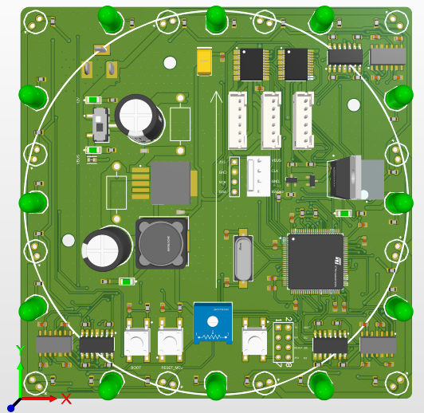
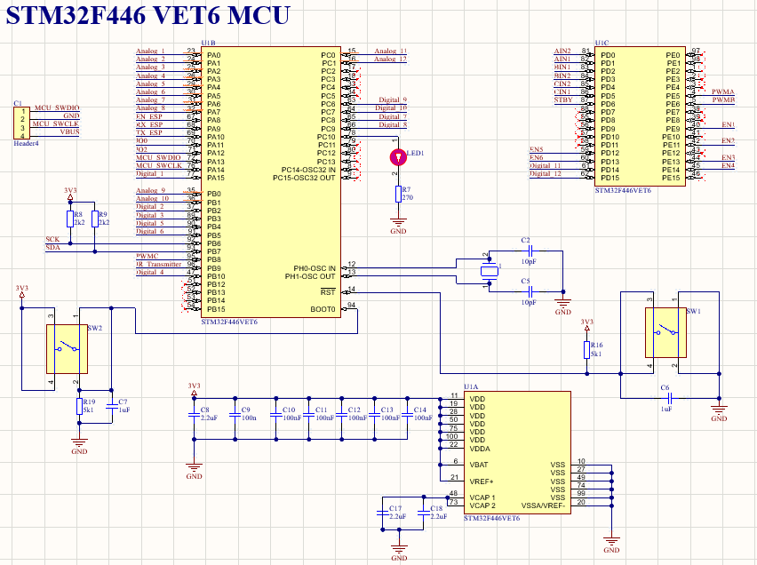
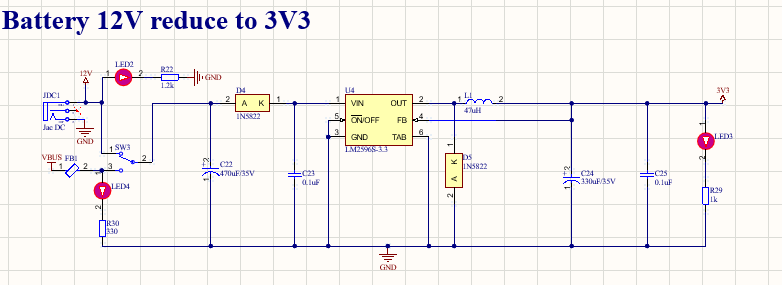
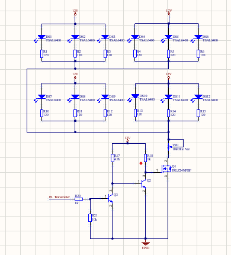
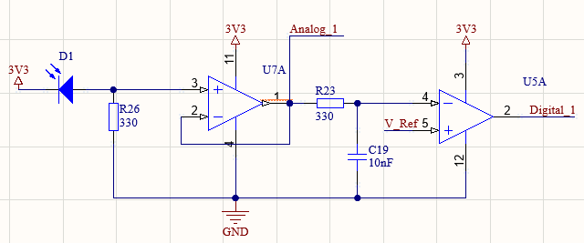
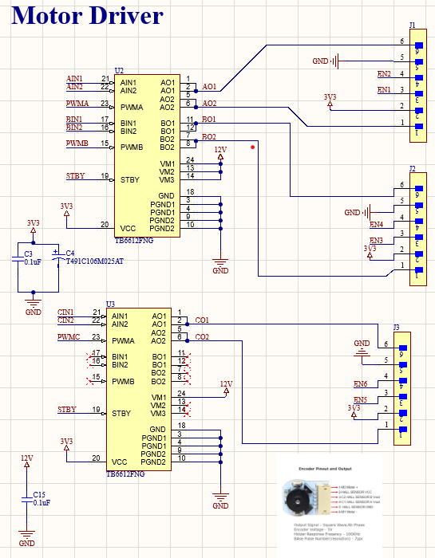

# IR Communication Robot (STM32-Based)

<div align="center">



</div>

A sophisticated infrared communication robot designed with STM32F446VET6 microcontroller, featuring comprehensive IR sensing, omnidirectional communication, and motor control capabilities.

<div align="center">

[](https://www.st.com/en/microcontrollers-microprocessors/stm32f446.html)
[](https://www.altium.com/)

</div>

## 🤖 Project Overview

This project implements an advanced infrared communication robot capable of:
- **360° IR Communication**: 12 IR LEDs (TSAL6400) positioned around the perimeter for omnidirectional transmission
- **Multi-directional IR Detection**: 12 photodiodes strategically placed for comprehensive IR signal reception
- **Dual Motor Control**: TB6612FNG motor drivers for precise movement control
- **Real-time Processing**: STM32F446VET6 ARM Cortex-M4 microcontroller with 512KB Flash
- **Power Management**: Regulated 3.3V supply with efficient switching regulator

## 🔧 Hardware Specifications

<div align="center">


*3D rendering of the complete PCB showing component placement and assembly*

</div>

### Main Components
- **Microcontroller**: STM32F446VET6 (LQFP100, 512KB Flash, ARM Cortex-M4)
- **IR Transmitters**: 12x TSAL6400 High-Power IR LEDs (940nm, 100mA)
- **IR Receivers**: 12x Photodiodes for 360° detection coverage
- **Motor Drivers**: 2x TB6612FNG (Dual DC Motor Driver, 15V, 24-Pin SSOP)
- **Power Management**: LM2596S-3.3 (3A Step-Down Voltage Regulator)
- **Amplifiers**: 4x LM324M (Quad Op-Amp) + 3x LM339 (Quad Comparator)
- **Crystal**: 8MHz (ABLS-8.000MHZ-B2-T) 

## 🏗️ Circuit Architecture & Schematics

### Central Processing Unit

<div align="center">


*STM32F446VET6 microcontroller schematic with support circuitry*

</div>

The heart of the robot is the **STM32F446VET6** microcontroller (U1), positioned at the center of the PCB:
- **Location**: Center of PCB for optimal signal routing
- **Package**: LQFP100 for maximum I/O availability
- **Support Components**:
  - 8MHz crystal oscillator for precise timing
  - Decoupling capacitors (100nF ceramic) for power filtering
  - Reset circuitry with external reset button
  - Programming header for SWD interface

### Power Management Section

<div align="center">



*Complete power management circuit schematic*

</div>

**Primary Power Stage**:
- **U4 (LM2596S-3.3)**: Main switching regulator
  - Input: 7-35V DC (recommended 12-24V)
  - Output: 3.3V @ 3A continuous
  - Efficiency: >85% typical
- **Supporting Components**:
  - **L1 (47µH)**: High-current inductor for switching operation
  - **C22 (470µF)**: Input filtering capacitor
  - **C24 (330µF)**: Output filtering capacitor
  - **D4, D5 (1N5822)**: Schottky diodes for protection

**Power Distribution**:
- Multiple ceramic capacitors (0.1µF, 1µF, 2.2µF) throughout PCB
- Dedicated power planes for clean power delivery
- Ferrite bead (FB1) for high-frequency noise suppression

### IR Communication Array

<div align="center">


*Schematic showing IR transmitter and receiver circuits with signal conditioning*

</div>

**IR Transmitters (DS1-DS12)**:
- **Type**: TSAL6400 High-Power IR LEDs
- **Arrangement**: Circular pattern with 30° spacing
- **Specifications**:
  - Wavelength: 940nm
  - Maximum current: 100mA
  - Forward voltage: ~1.35V
- **Current Limiting**: 330Ω resistors (R31-R48) for each LED
- **Positioning**: Around PCB perimeter for 360° coverage

**IR Receivers (D1-D12)**:
- **Type**: Photodiodes optimized for 940nm
- **Arrangement**: Aligned with transmitters for directional detection
- **Signal Conditioning**: Each photodiode connected to amplification circuit
- **Sensitivity Control**: Adjustable via potentiometer (VR1)

### Signal Processing Section

<div align="center">


*Op-amp and comparator circuit schematics for signal conditioning*

</div>

**Operational Amplifiers (U7, U9, U10 - LM324M)**:
- **Configuration**: Each photodiode signal is amplified
- **Gain**: Adjustable via feedback resistors
- **Filtering**: Low-pass filtering for noise reduction
- **Output**: Conditioned analog signals for ADC input

**Comparators (U5, U6, U8 - LM339DR2G)**:
- **Function**: Convert analog signals to digital logic levels
- **Threshold**: Set by reference voltage from potentiometer
- **Output**: Clean digital signals for microcontroller input
- **Response Time**: Fast switching for real-time communication

### Motor Control Section

<div align="center">


*TB6612FNG motor driver circuit schematics with control interfaces*

</div>

**Motor Drivers (U2, U3 - TB6612FNG)**:
- **Capacity**: Each driver controls 2 DC motors
- **Voltage Range**: 4.5V to 15V motor supply
- **Current Rating**: 1.2A continuous, 3.2A peak per channel
- **Control Inputs**:
  - PWM speed control from STM32
  - Direction control (AIN1, AIN2, BIN1, BIN2)
  - Enable pins for motor shutdown
- **Protection Features**:
  - Thermal shutdown
  - Overcurrent protection
  - Reverse voltage protection

### Power Supply
- **Input**: DC Jack connector (12-24V recommended)
- **Regulation**: LM2596S-3.3 switching regulator
- **Filtering**: Multiple capacitors (470µF, 330µF electrolytic + ceramic capacitors)
- **Protection**: Schottky diodes (1N5822) for reverse polarity protection

### IR Communication System
- **Transmission**: 12 IR LEDs arranged in circular pattern (30° spacing)
- **Detection**: 12 photodiodes with signal conditioning circuits
- **Range**: Optimized for medium-range robot-to-robot communication
- **Frequency**: 940nm infrared wavelength

## 📁 Repository Structure

```
ir_robot/
├── README.md                          # This file
├── ir_robot.PrjPcb                    # Main Altium project file
├── ir_robot.PrjPcbStructure           # Project structure
├── main.SchDoc                        # Main schematic document
├── ir_transmitter.SchDoc              # IR transmitter schematic
├── PCB1.PcbDoc                        # PCB layout design
├── ir_robot.BomDoc                    # Bill of Materials
├── ir_robot.OutJob                    # Output job configuration
├── __Previews/                        # Schematic previews
├── History/                           # Version history files
├── Project Logs for ir_robot/         # Design logs
└── Project Outputs for ir_robot/      # Generated outputs
    ├── Pick Place for PCB1.txt        # Component placement file
    ├── Design Rule Check - PCB1.html  # DRC report
    ├── *.gbr                          # Gerber files
    ├── *.DRL                          # Drill files
    └── *.pdf                          # Documentation PDFs
```

## 🚀 Features

### IR Communication
- **Omnidirectional TX/RX**: 360° coverage with 12 IR transceivers
- **Signal Processing**: Analog signal conditioning with op-amps and comparators
- **Noise Filtering**: Hardware filtering for reliable communication
- **Adjustable Sensitivity**: Potentiometer for signal threshold adjustment

### Motor Control
- **Dual TB6612FNG Drivers**: Support for 4 DC motors or 2 stepper motors
- **PWM Control**: Variable speed control via STM32 PWM outputs
- **Direction Control**: Forward/reverse control for each motor
- **Current Protection**: Built-in current limiting and thermal protection

### User Interface
- **Push Buttons**: 3x tactile switches for user input
- **Slide Switch**: Power/mode selection
- **Status LEDs**: Visual feedback for system status
- **Debug Headers**: Programming and debugging interfaces

### Connectivity
- **Programming Port**: SWD interface for STM32 programming
- **Expansion Headers**: Additional I/O for sensors and peripherals
- **Power Connectors**: Secure connections for motors and power supply

## 🛠️ Getting Started

### Prerequisites
- **Altium Designer** (for PCB design files)
- **STM32CubeIDE** or **Keil µVision** (for firmware development)
- **STM32CubeProgrammer** (for firmware flashing)

### Hardware Assembly
1. **PCB Fabrication**: Use provided Gerber files for PCB manufacturing
2. **Component Sourcing**: Refer to BOM (ir_robot.BomDoc) for exact part numbers
3. **Assembly**: Follow pick-and-place file for component placement
4. **Testing**: Verify power supply voltages before connecting sensitive components

### Firmware Development
1. **Initialize STM32 Project**: Configure STM32F446VET6 with appropriate peripherals
2. **Configure Peripherals**:
   - PWM for IR LED control
   - ADC for photodiode reading
   - Timer interrupts for communication protocol
   - GPIO for motor control and user interface

### Programming
```bash
# Clone repository
git clone https://github.com/longnp54/pcb_ir_robot.git

# Open in STM32CubeIDE
# Configure project for STM32F446VET6
# Build and flash firmware
```

## 📊 Technical Specifications

| Parameter | Specification |
|-----------|---------------|
| MCU | STM32F446VET6 (ARM Cortex-M4, 180MHz) |
| Flash Memory | 512KB |
| RAM | 128KB |
| Operating Voltage | 3.3V |
| Input Power | 12-24V DC |
| IR Wavelength | 940nm |
| IR Range | ~2-5 meters (depending on ambient light) |
| Motor Voltage | Up to 15V |
| PCB Dimensions | 100mm x 100mm (approx.) |
| Layers | 2-layer PCB |

## 🔄 Communication Protocol

The robot implements a custom IR communication protocol:
- **Modulation**: 38kHz carrier frequency (configurable)
- **Encoding**: Manchester encoding for data reliability
- **Packet Structure**: Header + Address + Data + CRC
- **Multi-robot Support**: Addressing scheme for robot identification

## 🎯 Applications

- **Swarm Robotics**: Coordinate multiple robots with IR communication
- **Educational Projects**: Learn embedded systems and robot communication
- **Research Platform**: Study distributed robot systems
- **Competition Robotics**: Implement team coordination strategies

## 🤝 Contributing

Contributions are welcome! Please:
1. Fork the repository
2. Create a feature branch (`git checkout -b feature/AmazingFeature`)
3. Commit your changes (`git commit -m 'Add some AmazingFeature'`)
4. Push to the branch (`git push origin feature/AmazingFeature`)
5. Open a Pull Request

## 🙏 Acknowledgments

- STMicroelectronics for STM32 ecosystem
- Vishay for high-quality IR components
- Toshiba for reliable motor driver ICs
- Open-source community for inspiration and support

## 📧 Contact

**Project Maintainer**: longnp54
- Email: longnp54@gmail.com
- GitHub: [@longnp54](https://github.com/longnp54)
- Repository: [pcb_ir_robot](https://github.com/longnp54/pcb_ir_robot)

---

*Built with ❤️ for the robotics community*
